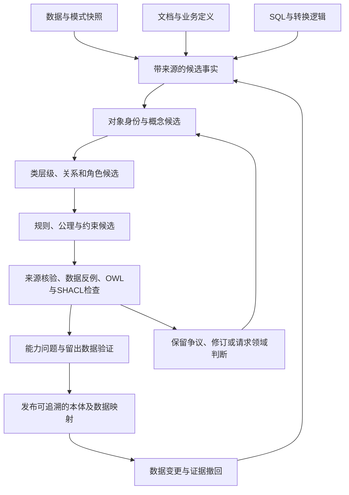

# 本体自动构建：方法、效果边界与从数据出发的实现路线

研究日期：2026-09-20。范围：本地18篇原文及对应译文，并按其中暴露的问题扩展检索论文、标准和公开实现。本报告是证据审阅与方案分析，没有运行论文模型，因此不宣称完成独立复现。

**主要判断：目前已有方法能自动完成不少局部工作，也出现了从文本直接发现概念模式的系统；现有证据仍不足以证明，任意原始数据可以在没有领域确认的条件下，自动变成语义正确、逻辑一致、可执行且可持续维护的完整本体。更有依据的路线是分阶段生成候选，用来源、数据反例、形式检查和任务测试逐步确认。**这个判断来自任务定义、跨域失败、关系抽取结果和人机协作实验的共同限制，并非认为自动化没有价值。[L01 §3–4；L02 §3–5；L12 表2；L17 表3；L18 §5–6；E03、E06、E14、E16]

阅读配套材料：[18篇逐篇分析](02_本地18篇文献逐篇分析.md)、[扩展研究与开源实践](03_扩展研究与开源实践.md)、[证据索引与核验说明](04_证据索引与核验说明.md)、[建议的构建与验证方案](05_从数据构建本体_方案与实验设计.md)。L01–L18为本地文献编号；E/S/P编号对应扩展报告。页码均指PDF文件物理页，从1开始。

## 1. 先确认这些论文真正研究了什么

### 1.1 18篇资料并非18个独立构建系统

资料由14篇方法/应用研究、2篇挑战赛综述、1篇数据集论文和1篇前言组成。2025的11篇参赛论文共用大量数据与评测规则，其结果能横向参照，但不能当作11个相互独立的真实部署案例。第16篇只有2页前言，没有独立方法或实验。[L03、L04、L05–L17]

2024与2025任务字母发生了变化。如果直接按“Task A”汇总，会把不同问题混在一起。

| 实际任务 | 2024 | 2025 | 输入与输出 | 它没有直接验证什么 |
|---|---|---|---|---|
| 从文本提取术语/类型 | 未作为该届三项主任务 | A：Text2Onto | 文本→术语或类型标签 | 完整层级、关系、公理及数据映射 |
| 术语分类 | A | B | 已给术语→类型集合 | 从原始数据发现未知概念 |
| 分类层级发现 | B | C | 已给类型集合→父子关系 | 概念词汇的完整发现、非分类关系 |
| 非分类关系发现 | C | D | 给定类型集合及预定义关系集→关系三元组 | 新关系类别发现、任意形式公理和实际业务规则 |

证据：[L03 §2；L17 §2、PDF p3–6]。其中2025 A的文本由已有本体元素经过模板表述和LLM改写生成，属于受控合成材料。它能测试从这些文本恢复标签的能力，尚不足以证明能处理自然业务文档中的隐含定义、互相矛盾的口径、跨页表格或历史版本。[L17 PDF p5]

### 1.2 “端到端”需要说明起点、终点和训练条件

第1篇LLMs4OL虽然使用端到端表述，实际核心评测是分类、层级及关系判断；从语料抽取术语和公理发现没有纳入该篇实验。第2篇OLLM确实将文本直接生成局部分类图，再合并为整体图，但训练依赖既有本体与文档概念标注，实验输出限于概念和分类边。两者都有价值，自动化范围不同。[L01 PDF p7–9图1、§3–4；L02 PDF p4–5 §3–4、p10局限]

评价一项工作时，至少写清六个问题：输入是否已有术语、是否已有类型、是否给定目标关系、是否使用目标领域标注、输出是否含公理、是否验证了原始数据到最终应用的全过程。本报告依此检查，而不按论文标题判断能力。[分析口径；依据L01/L02/L17的不同任务设置]

### 1.3 本体成果应当分项检查

本体通常至少包含概念与关系的语义；表达更丰富时，还包含逻辑公理。工程中还需把它连接到实际数据。下面的检查项是本次分析框架，不声称所有本体都必须达到同一种表达复杂度。

| 成果 | 要回答的问题 | 仅有哪种证据还不够 |
|---|---|---|
| 术语与概念 | 这个词在当前领域指什么？ | 词频、相似度、标签拼写匹配 |
| 概念层级 | 每个A是否在规定语义下也是B？ | A和B经常一起出现 |
| 关系及角色 | 谁以什么角色与谁关联？方向是什么？ | 两表能JOIN、两列同名 |
| 公理与约束 | 是普遍定义、约束要求，还是样本规律？ | 当前样本全部符合 |
| 物理数据映射 | 概念对应哪些字段、变换、筛选和时间？ | 生成了一个OWL/TTL文件 |
| 可用性与维护 | 查询结果正确吗？证据撤回后如何更新？ | 查询能执行、图规模增大 |

前四项的区分依据本地任务定义、描述逻辑学习及OWL规范；后两项是结合数据库映射和应用验证提出的工程检查项。[L17 §2；E03/E11；S01/S03]

## 2. 本地文献的方法可以归为六条路线

### 2.1 直接提示与推理提示：低标注成本，效果依赖领域

典型工作是LLMs4OL初始研究、Phoenixes，以及部分LABKAG和Alexbek实验。做法是把分类或关系问题改写成提示词，必要时补充说明、示例或要求模型分步处理。它减少了专门训练成本，但模型需要知道领域词义、准确理解关系方向，并按照标签格式输出。[L01 §3；L06 §3；L07 §3；L13 PDF p3–6 §2.1–2.2]

**是否有效：有局部结果，但不能把推理过程存在当作改进证据。**Phoenixes工程域术语抽取最好F1为0.2556，论文比较不同模型在同类提示下的结果，没有同模型“有/无推理提示”的严格消融。因此证据支持“实现了该策略并取得这些结果”，无法单独确认推理提示贡献。[L06 结果表，详见逐篇分析]

### 2.2 分阶段抽取、批处理与标签归一：输出控制有实际作用

SBU-NLP针对抽取、分类、层级分别设计步骤，配合批量提示、候选方法和规则处理；ELLMO分别处理术语、类型与关系。这些工作说明：原始模型回答需要变成可对照的结构化结果，格式、标签粒度和候选范围都会影响最终分数。[L05 §3；L11 §3]

SBU-NLP在2025 OBI术语分类B1达到0.9425，但同届OBI层级发现C1为0.3534；不能把前者当作OBI本体自动构建准确率。论文还指出，OBI层级发现中复杂嵌入方法相对词元重叠基线的收益有限，便宜的字符串方法值得保留为基线。[L17 PDF p7表3；L05 表4、§4]

**判断：**应优先查错误发生在候选发现、语义判定还是输出归一，避免所有问题都用更大模型解决。分阶段方法便于查错；其有效性仍须通过固定数据上的组件消融确认。

### 2.3 近邻分类、检索示例、外部定义和数据增强：收益明显但不稳定

T-GreC先监督微调编码器，再用术语表示做1-NN分类；Alexbek部分任务检索训练示例作为提示；IRIS做数据增强、定义补充和候选过滤；LABKAG给提示增加上下文。这些方法试图缓解小样本和专业词义缺失，近邻分类与检索增强提示是不同机制。[L07 §3；L09 §3；L12 §3；L13 §2]

T-GreC中，OBI的RoBERTa表示加1-NN分类F1为0.862，模型直接分类为0.827；但原始数据配置下，同一方法在SWEET为0.062对0.519，在MatOnto为0.027对0.108。各数据集分别训练，仍出现明显差异，**OBI上的有效方法不能直接当作通用方案**。这里既不是提示词示例对照，也不是OBI模型的零样本迁移实验。[L12 PDF p4–5表1–2；个别官方提交与局部配置结果须分开，见逐篇分析]

IRIS在SWEET关系任务D中，随机负例基线F1=0.058，过滤后0.391，过滤加定义后0.532；仅加定义为0。它有直接对照，支持候选处理与定义组合在这个设置有效。然而过滤同时改变训练负例和推理候选，不能把全部收益归因于某一个环节，也不能推到所有领域。[L09 PDF p13表5；p11 §3.2.2]

### 2.4 集成、聚类和嵌入：必须检查候选召回及额外成本

DREAM-LLMs结合多模型意见；silp_nlp用聚类和多阶段任务设计；CUET_Zenith结合嵌入与LLM；Alexbek比较多种异构方法。它们试图减少单模型偏差、缩小比较范围或发现层级结构。[L08、L10、L13、L14的方法节]

集成后的好成绩不能自动证明每个模型或每轮讨论有增益，需要同模型调用预算、单模型对照和组件消融。聚类则存在一个硬限制：如果真实关系两端在候选阶段被排除，后续分类器无法恢复该关系。ELLMO的GO关系候选召回仅0.0975，说明候选阶段本身就可能成为瓶颈。[L08实验设置；L11 PDF p10表10；后一个结论为集合覆盖关系推导]

**判断：**同时报告“候选召回、进入候选后的判定质量、总成本”；不能仅展示最后的Precision或更小的候选集合。

### 2.5 专项微调与文本生成分类图：能力更专门，迁移需要独立检验

SEMA在MatOnto上做提示形式解耦的LLaMA微调；OLLM从训练语料和参考分类结构学习生成局部图。前者重点是给定类型的层级判断，后者更接近从文本发现分类图，训练所需先验不同。[L15 §3–4；L02 §3–4]

SEMA官方MatOnto C2的F1为0.1441，同届同任务SBU-NLP为0.6621。这个比较说明该提交没有显示领先效果；模型、资源和策略不同，不能进一步归因成“微调必然不如提示”。其论文只有单领域实验，也不足以证明跨域迁移有效。[L17 PDF p7表3；L15实验节]

OLLM用Continuous F1衡量生成图与参考图的边相似度：先按端点文本嵌入相似度对边做最大权重一对一匹配，再计算软精确率与召回率的调和平均。同域Wikipedia上，OLLM为0.500，直接微调为0.470；迁移至arXiv、再用2,048个文档—子图样本适配后，分别为0.357和0.225。结果支持高频关系损失屏蔽在这些设置下改善分类图生成；该指标不是逐边事实准确率，作者也未做重复实验或报告误差条。非分类关系、公理及业务映射未在这些实验中验证。[L02 PDF p6 §4.2、p8 §5.1、p9表1、p10局限、p38检查清单第7项]

### 2.6 人机协作：适合工程落地，现有案例不等于自动化定论

第18篇从11人访谈和温室案例研究人机协作，覆盖需求、能力问题、术语/关系、实现与检查。11名受访者中，10名是本体工程师，1名主要研究LLM/NLP；这不是11人参加构建效果的受控实验。它提供较完整的工程过程，但不是无人干预系统的受控评测。[L18 PDF p3 §3.1；p11–17 §5–6]

论文中16小时与40小时对应不同经验者，不能当作同一任务条件下严格测得的60%时间节省。16条SPARQL均语法可执行、填入实例后14条有结果，也不能等价为14条业务答案正确。案例支持“LLM能够辅助多个步骤，专家检查仍关键”，尚不支持普遍生产率或正确率结论。[L18 PDF p13、p15–16；p23–25附录，详见逐篇分析]

## 3. 哪些不足已有解决证据，哪些仍未解决

| 现有不足 | 研究采取的措施 | 现有证据允许的判断 | 还缺什么 |
|---|---|---|---|
| 专业词义不足 | 近邻分类或示例检索、补定义、数据增强 | T-GreC/IRIS有同设置收益，也有降分 | 新领域、错误定义和低覆盖情形的稳健性 |
| 标签和格式不统一 | 批处理、解析、标签归一 | 可以减少输出/评价接口错误 | 名称归一后的语义等价证据 |
| 关系候选数过大 | 嵌入筛选、聚类、限制候选 | IRIS显示明显收益 | 候选外真关系、训练/推理贡献分离 |
| 层级局部判断彼此冲突 | 图合并、图结构算法 | OLLM与经典taxonomy方法提供路线 | 全局一致性、公理兼容与多父语义验证 |
| 同义词导致重复 | 定义归一、实体匹配、聚类 | EDC/iText2KG有归一评估 | 同名异物、角色/类型、上下位误合并 |
| 只靠模型知识缺少来源 | 外部检索、ontology grounding | 可提供候选证据或已有ID | 每条主张的支持关系、否定/时间/范围核验 |
| 缺少公理与约束 | 类表达式、规则挖掘、QSE/FCA | 有独立成熟任务或新研究 | 统计规律升级为普遍规范的依据 |
| 工程维护与增量变更 | 增量合并、版本与人工复核 | 有实现路线及案例 | 删除/撤回、概念拆分、回滚的长期实验 |

证据依次为：L07/L09/L12；L05/L11；L09/L11；L02/E02；E04/E05/E07；E08/E16；E03/E14/E15/E16；E01/E05/L18。表中“还缺什么”是对这些工作已验证范围的分析，不表示世界上没有其他相关研究。

### 3.1 在当前资料中，领域差异比“使用哪种技术名词”更值得重视

2025统一评测中：OBI分类最好0.9425；OBI层级最好0.3972；FoodOn层级最好0.1171；FoodOn非分类关系最好0.0084，GO非分类关系没有提交。不同任务、候选集合和参考标注不同，不能用这些数值计算某种统一能力下降幅度；但它们足以反驳“在一个分类任务达到高分，就已解决各类本体构建”的外推。[L17 PDF p7表3]

总榜Mean F1还受到参赛覆盖范围影响，未提交任务进入总分分母。比较方法时应回到同一子任务、同一测试集及同一评价规则。不得把总榜高低直接解释为单任务平均精度。[L17 §3及表3；逐篇核验]

### 3.2 评测本身仍有四个缺口

**受控数据与自然材料之间的差距。**从已知本体生成文本，再恢复本体元素，是有价值的受控测试；它减少了真实材料中“不知道该抽什么、来源不完整、定义互相冲突”的困难。[L17 PDF p5；E10 §3.3]

**字符串指标与语义指标之间的差距。**精确匹配会惩罚合理别名；宽松语义匹配也可能把不同粒度的类视为近似。应分别报告词面、规范ID、定义和逻辑关系的匹配，不能只选有利的一项。[L17 PDF p6；L02评价节；分析建议]

**局部准确与整体可用之间的差距。**给定类型对分类正确，不代表最终图无环、关系方向一致、业务含义正确；可执行查询也不保证答案正确。[L02输出范围；L18验证案例；S03]

**模型评审与独立事实核验之间的差距。**LLM评审能扩展评测规模，但它的遗漏、偏好和领域盲点也会影响结论。模型评审分数应和人工盲审、来源支持、规则检查分别记录。[E06/E07实验设置；分析建议]

### 3.3 原文和公开实现也有需要核对的地方

本次发现了原文表格/描述不一致及复现材料缺口。例如LABKAG部分表格的P/R/F1不能同时成立；ELLMO部分表格也有同类问题。SEMA当前代码有静态可见的运行及候选枚举问题，但这不能反推历史评测无效。Phoenixes当前仓库没有足以复现实验的实现。具体位置、原PDF截图和代码快照见逐篇报告。[L06/L07/L11/L15逐篇证据]

译文目录本身说明未重新校订全文，且第1篇包含补充问答。我们将译文作为阅读辅助，实验数值和论文主张回查原文；已有译注识别的问题不归罪于翻译。这里也没有进行18篇逐句翻译质量审校。[翻译/README.md；逐篇报告的译文核验记录]

## 4. 如何真正从数据自下而上构建

### 4.1 不同数据能提供的证据不同

| 数据来源 | 适合自动获得的候选 | 不能单靠它确认的语义 | 对应研究依据 |
|---|---|---|---|
| 表结构、主外键、字段类型 | 实体候选、属性、连接路径、类型限制 | 表是否等于业务对象、连接是否等于业务关系 | S01 |
| 记录值、分布、缺失、唯一性 | 枚举、键、基数及约束候选 | 样本中成立是否代表规范上必须成立 | E03/E14/E15 |
| SQL、视图、ETL、查询记录 | 派生表达式、筛选条件、实际使用的连接 | 编码规则是否仍符合当前业务定义 | S01，加本报告工程推论 |
| 文档、词典、规范、说明 | 概念定义、别名、角色、事件和关系 | 文本是否权威、是否已过期、有无例外 | E04/E05/E08 |
| 已有事实图及少量种子本体 | 类表达式、关系规律、形状、候选复用 | 背景图本身是否正确完整 | E03/E14/E15/E16 |
| 专家问答和实际问题 | 适用范围、不能从数据观察到的要求 | 未讨论问题的完整覆盖 | L18 |

**分析：数据驱动不应限定为只读记录值。**如果任务允许访问表定义、SQL和说明，应把它们作为独立证据源。但在比较方法时，必须明确哪些输入被允许，避免给某种方法额外定义而仍声称是在“裸数据”条件下比较。

### 4.2 有限数据不能唯一决定业务本体

以下是说明性例子，不是用户目录中的真实业务数据：一张表包含`customer_id, company_id, amount`，且每个客户在当前月份只对应一家公司。它同时兼容“客户永久隶属公司”和“每月只有一个签约主体”两种解释。只观察这一个月，不能决定应当建立永久对象关系、带时间的角色关系，还是合同事件。

同样，样本中没有退款订单，不能推出“订单不允许退款”；字段经常为空，不能推出业务上允许为空；两个对象当前值完全相同，也不能推出它们身份相同。这是从相同观测可对应多种模型得出的可识别性限制。形式学习中的背景词汇、完整性假设和专家oracle，正是为缩小这种不确定性提供额外条件。[本报告逻辑例证；理论参照E03/E11/E15/E16]

因此，自下而上的系统应当输出四种不同状态：**观察到的事实、归纳出的候选规律、有外部定义支持的语义、经确认的约束/公理。**状态区分是本报告建议，不应把模型自报的confidence直接解释为正确概率。

### 4.3 建议把生成和确认分开组织

这是基于前述模块提出的组合方案，尚未验证整体效果。各阶段可参考的实现、输入输出与验收办法详见[方案与实验设计](05_从数据构建本体_方案与实验设计.md)。

**候选事实阶段**保留原始文件、页码/段落、表/列、SQL范围、时间和适用条件，先确认“来源到底说了什么”。开放抽取和模式约束抽取都可以使用，但不能将二者的先验条件混淆。[E04/E08；工程建议]

**概念阶段**分开处理实例身份、类别同义、上下位、部分整体和角色。相似度只做候选召回；是否合并由定义、实例反例和使用范围共同决定。把相似词都并成一类，会让图看起来更整齐，却可能损坏语义。[E04/E07的归一问题；工程推论]

**关系阶段**先判断关系种类及方向，再形成全局结构。`is-a`、`part-of`、`instance-of`、`has-role`应使用不同测试条件；同一连接在不同时间或业务场景下可以表达不同角色。[L10/L13的层级方法；L17的任务区分；本报告设计建议]

**公理阶段**并行产生统计规则和语义定义。QSE、AMIE、DL-Learner、FCA可提供候选或可检查表达式；只有来源与范围足够清楚、反例得到解释时，才升级为正式约束。不能把在当前数据里高频成立直接改写成“所有”。[E03/E14/E15/E16；工程推论]

**确认阶段**分开做来源支持、逻辑一致性、数据符合性和应用答案核验。每一层失败都应能回到具体候选及其证据；工具能解析、推理器通过、查询有结果，各自只说明对应检查通过。[S03；L18；工程建议]

## 5. 现阶段应该怎样判断“解决有效”

本报告使用四种证据状态，不把它们当作论文质量排名：

1. **有直接对照支持**：同一数据与基本设置下，对目标组件有消融或对照。例：IRIS过滤/定义组合、T-GreC近邻分类。
2. **有任务结果支持**：基准成绩表明该完整方法在指定任务可用，但组件贡献或泛化原因没有隔离。例：若干挑战赛系统、端到端分类图生成。
3. **有案例或实现支持**：能看到流程、输出或代码；缺少严格同条件比较。例：第18篇的部分效率主张、尚无效果论文的新仓库。
4. **待验证的方案**：本报告提出的组合架构、阈值和验收计划，不能当成已获得的性能。

“有效”还要同时回答：对哪个任务、比什么基线、输入哪些信息、花多少成本、在哪些领域失败。既没有独立复现，也没有中国企业自然数据评测的地方，都保留该限制。[分析规则；依据各论文实验设计差异]

建议采用以下结果面板，而不是一个总F1：

| 维度 | 核心指标 | 为什么需要 |
|---|---|---|
| 发现覆盖 | 新概念/关系召回、候选召回 | 防止靠保守少抽提高精度 |
| 语义正确 | 定义、关系方向、身份合并的盲审精度 | 区分词面相近与含义一致 |
| 结构质量 | 环、错误父类、不可满足类、意外推论 | 防止局部正确造成全局错误 |
| 公理/约束 | 留出反例、违反率、适用范围 | 防止把样本偏差固化成规则 |
| 数据落地 | 映射正确性、粒度、过滤与时间一致性 | 防止只有概念图没有数据语义 |
| 应用效果 | 固定能力问题的答案及来源正确率 | 防止用执行成功代替答对 |
| 维护与成本 | 人工修订时间、每条通过项成本、增量回归 | 判断自动化是否实际省工 |

这些指标是针对已识别缺口提出的评测方案；详细对照组、数据隔离与验收条件见配套实验设计。

## 6. 开源与落地选择

已有明确代码许可、值得分模块验证的项目包括：OLLM、LLMs4OL、SBU-NLP、DREAM-LLMs、IRIS、EDC、AutoSchemaKG、iText2KG、OntoGPT、Ontop、DL-Learner/Ontolearn、QSE和OntoLearner。它们承担不同环节，尚没有证据支持直接把这些名称组合成“已完成的一体化系统”。仓库可用性和许可检查详见逐篇报告及扩展报告。[相关作者仓库的2026-09-20核验]

如果近期做原型，本报告建议三组对照并行推进：

- **文本路线**：简单直接提示作为基线，EDC验证关系归一，AutoSchemaKG验证概念/事件归纳，OLLM验证有监督分类图生成。各自给定先验要单列。
- **结构化路线**：用确定性映射建立可追溯物理图，再增加列语义、定义、关系和规则候选；不要一开始就把表结构直接命名为领域本体。
- **已有知识路线**：已有模式下用OntoGPT填充，已有实例图上用QSE/AMIE/DL-Learner测试约束与逻辑归纳，分别衡量新增正确知识和错误传播。

这是根据输入和输出匹配提出的试验优先级，未对这些工具做统一实测。初期最值得验证的假设是：**明确来源和候选范围，加上针对性的反例及结构检查，能否在保持覆盖的同时减少人工修订。**不能预先保证整套方案优于简单基线；实验应允许它失败，并能说明失败在哪个阶段。
